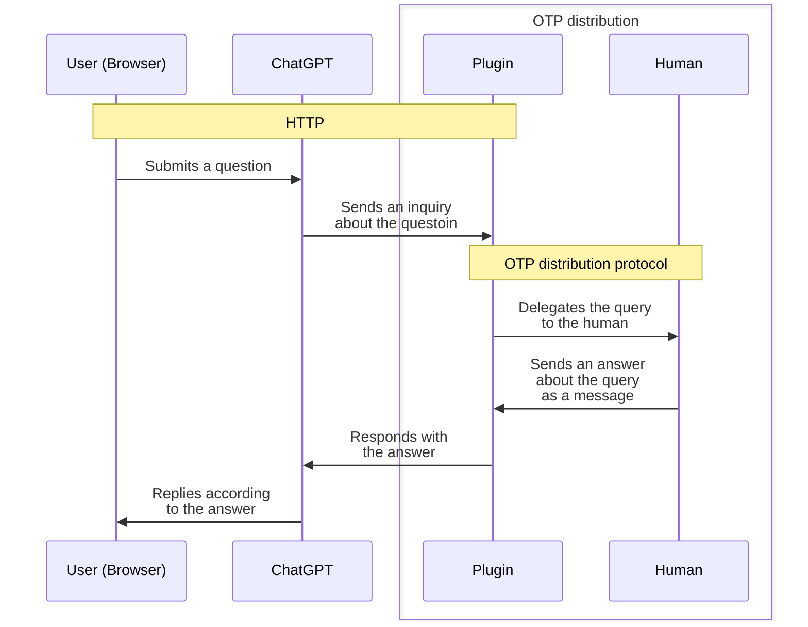

# HumanTool

A ChatGPT plugin to use humans as a tool.

## Usage

1. Start the plugin server:

```sh
iex --sname plugin@localhost -S mix
```

2. Install the plugin into ChatGPT as a localhost plugin
3. Start the interface for a human

```sh
iex --sname human@localhost lib/human_tool/human.ex
```

See the video for further details:

<iframe width="560" height="315" src="https://www.youtube.com/embed/zt0zXF1cMPg" title="YouTube video player" frameborder="0" allow="accelerometer; autoplay; clipboard-write; encrypted-media; gyroscope; picture-in-picture; web-share" allowfullscreen></iframe>

## Architecture



## Author

Kentaro Kuribayashi &lt;kentarok@gmail.com&gt;
